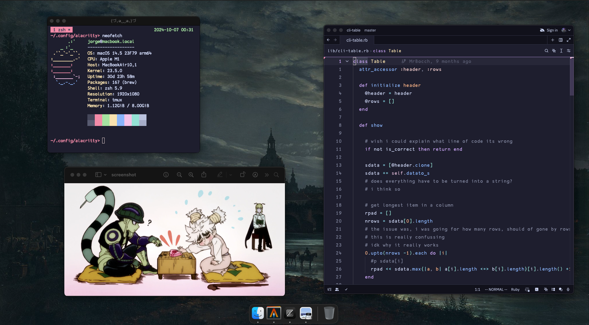

# dotfiles

## dark-mode



## light-mode


*need to write a script to switch between easy*

its easy to just git ```git checkout light``` but 
to change wallpaper, then change system appearce to
white, manually thrue the settings is super annoying
could probably write a script for this right

*also, need to change font offset in zed like in alacrity, i dont think this is a setting yet?*

I remember when I first got into linux because I saw a very pretty 
rice on the internet.

I have this interesting idea for switching between light and dark mode,

There is a master branch and a light branch, currently the light
branch only changes theme for alacritty + zed theme. The master branch
is the dark.

```
git checkout light

git checkout dark
```

I have only used git, as a sort of archive, not as source controll, so I have 
some doubts

What if i make a change that i want both branches to have, lets say, change font-size?

what do then?
